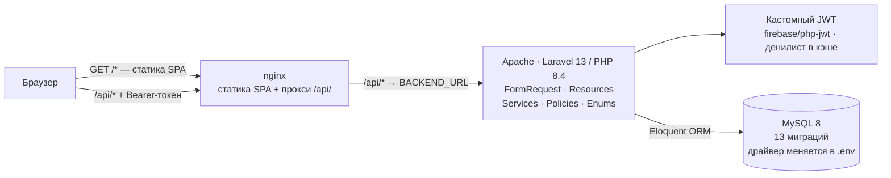
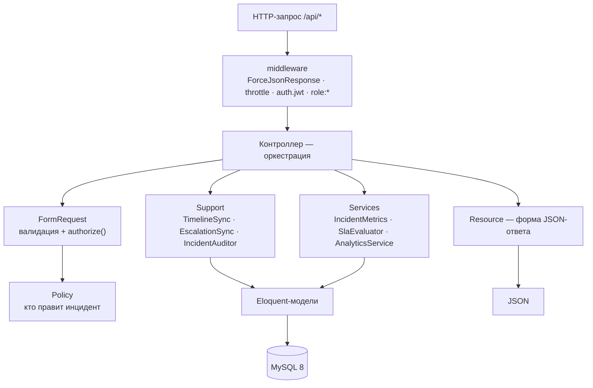
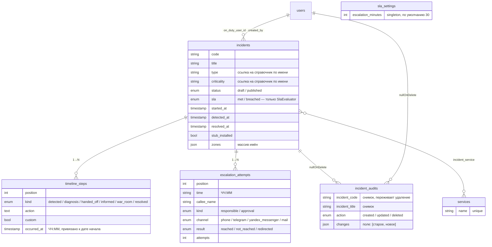
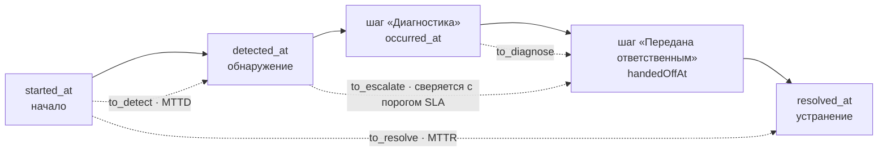
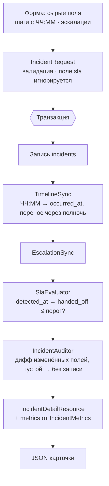

# Системный анализ IMS (Incident Management System)

> Версия анализа: 2026-09-09 · составлено по фактическому состоянию кода.
> Часть I — бизнес-контекст. Часть II — техническое описание.
> Статус: фронтенд и бэкенд соединены, работают на реальных данных, не прототип на моках.

---

## Часть I. Бизнес-контекст

### 1. Кратко

IMS — веб-реестр IT-инцидентов: единая форма регистрации, структурированный
постмортем (хронология + эскалации) и дашборд, где метрики надёжности
(MTTD, MTTR, SLA и ещё ~20 показателей) считаются автоматически, а не собираются
руками. Заменяет общую Excel-таблицу.

Роли: **администратор** (полный доступ) и **дежурный** (создаёт инциденты,
редактирует только свои). Развёртывание — два контейнера (API на PHP/Apache и
статика SPA за nginx) плюс MySQL; сервис только во внутренней сети.

### 2. Проблема: инциденты жили в Excel

До IMS каждый инцидент фиксировали вручную в общей таблице на сетевом диске.
Это работает, пока инцидентов мало и вопросы к данным простые — оба условия
быстро перестают выполняться.

> Таблица одинаково хорошо принимает «14:32», «14.32» и «около половины
> третьего» — и одинаково плохо превращается в отчёт для руководства.

- **Неструктурированный ввод.** Нет обязательных полей — тип, критичность, зона
  вписываются от руки, и в одной колонке уживаются «Backend», «бэк»,
  «backend-команда»: три разных значения для аналитики.
- **Метрики считаются вручную.** Среднее время реакции или доля нарушений SLA —
  это формулы над датами-текстом; при ошибке формата ячейка молча не считается.
- **Постмортем нигде не живёт целиком.** Хронология, эскалации (кому звонили,
  сколько раз) и причина оказываются в разных вкладках или не фиксируются вовсе.
- **Нет ролей и истории изменений.** Любой с доступом к файлу стирает строку;
  кто и когда — не восстановить.
- **Аналитика — разовая ручная работа.** Каждый новый разрез отчёта (по зоне, по
  времени суток, по каналу эскалации) — это новая выгрузка и фильтрация.

### 3. Что меняет IMS

**Регистрация инцидента**
- Форма с обязательными полями: название, сервис(ы), тип, критичность, дежурный,
  время начала. Опубликовать инцидент без базовых данных нельзя.
- Один инцидент может затрагивать несколько сервисов одновременно.
- **Черновик:** если постмортем не готов (нет причины) — инцидент сохраняется
  черновиком и помечается в списке, данные не нужно выдумывать ради сохранения.

**Постмортем**
- Хронология по шагам: обнаружено → диагностика → передано ответственным →
  решена, плюс опциональные «информирование» и «war room», плюс произвольные
  промежуточные шаги. Порядок шагов меняется стрелками.
- Журнал эскалаций: кому звонили, каким каналом, тип (ответственный /
  согласование), результат (дозвонился / не дозвонился / переадресовал), сколько
  попыток.
- Заглушка (временное решение) — отдельно: когда установлена, когда снята.

**Аналитика без ручной сборки**
- KPI за период со сравнением к предыдущему: число инцидентов, среднее время
  решения, доля соблюдённого SLA.
- Средние времена: до обнаружения, на диагностику, до эскалации.
- Тепловая карта «день недели × час обнаружения» — когда система рвётся чаще.
- Разбивки: по зонам, по типам, топ проблемных сервисов.
- Надёжность эскалаций: затянутые эскалации, рецидивы, ночь/выходные, дозвон
  с первой попытки, частота war room, скорость каналов связи.
- Клик по любому графику → список инцидентов, из которых он собран.

**Справочники — без разработчика.** Сервисы, зоны, типы, критичность
редактируются в разделе «Администрирование»: добавить, переименовать, удалить.
Переименование протаскивает новое название во все инциденты. Удаление
заблокировано, пока значением пользуется хотя бы один инцидент.

**Порог SLA** — одно число (минуты от обнаружения до передачи ответственным),
задаёт администратор; при изменении сервер пересчитывает вердикт по всем
инцидентам.

**Пользователи** — учётки заводит администратор (логин, не email);
самостоятельной регистрации нет.

### 4. Ценность для бизнеса

| Показатель | Значение |
|---|---|
| Кликов от вопроса руководителя до цифры | 2 — открыть дашборд, выбрать период |
| Форм на один инцидент | 1 — вместо разрозненных вкладок |
| Строк кода, чтобы добавить сервис/зону/тип | 0 — через интерфейс |
| Ролей доступа | 2 — администратор и дежурный |

- **Руководству** — картина надёжности по требованию; видно, какие сервисы и
  зоны требуют внимания в первую очередь.
- **Дежурным** — меньше рутины на оформление, один процесс вместо «как
  договорились в этот раз».
- **Для решений об инвестициях** — куда вкладываться в надёжность, по частоте
  инцидентов и MTTR на сервис, а не по ощущениям.

### 5. Было / стало

| Excel-таблица | IMS |
|---|---|
| Свободный текст в ячейках, дубли уживаются рядом | Управляемые справочники, дубли отклоняются при вводе (в т.ч. по регистру и кириллице) |
| Метрики — ручные формулы над датами-текстом | MTTD, MTTR, SLA и агрегаты считаются автоматически |
| Хронология и эскалации — в разных вкладках | Структурированный постмортем в одной карточке |
| Любой стирает строку без следа | Черновики, роли, журнал изменений с диффом полей |
| Новый разрез отчёта — ручная выгрузка | Дашборд и тепловая карта обновляются сами; клик по графику → детали |
| Вердикт SLA считает тот, кто заполняет | Вердикт SLA выносит сервер, клиент не может его переспорить |

### 6. Текущий статус и ближайшие шаги

| Статус | Направление |
|---|---|
| 🔴 Заблокировано | **Единая корпоративная авторизация (SSO)** — экран входа выделен отдельно, переход не требует переписывать приложение. Ждём токен от команды SSO. |
| 🟡 Планируется | **Серверная пагинация и фильтрация списка** инцидентов — сейчас клиент грузит весь список и фильтрует в памяти (приемлемо на текущем объёме). |
| 🟡 Планируется | **Обобщение под другие команды** — требует решения о модели данных (общие инциденты или изолированные пространства на команду) до начала разработки. |

---

## Часть II. Техническое описание

### 1. Общая картина

Классический SPA поверх REST API. Два независимых образа: nginx раздаёт собранную
статику фронта и проксирует `/api/` на бэкенд (Laravel/Apache). Для браузера всё
на одном origin — CORS в проде не нужен.

**Почему две части.** Правило размещения репозиториев требует раздельных
`backend` / `frontend` (см. `REPO.md`). Vite собирает статику в `frontend/dist`,
nginx отдаёт её на все пути, кроме `/api/`, который уходит на бэкенд по
внутреннему адресу `BACKEND_URL`. Локально ту же роль играет dev-прокси Vite.

**Ключевой принцип — расчёты на сервере.** Всё, ради чего систему заводили
(метрики, вердикт SLA, агрегаты дашборда), считает бэкенд. Клиент отправляет
сырые данные формы и рендерит готовые числа. Браузер не может ни исказить
вердикт, ни разойтись с сервером в формуле.

### 2. Архитектура

**Бэкенд (`backend/`, Laravel 13).** Слои:

| Слой | Что делает | Примеры |
|---|---|---|
| Контроллеры | тонкие, только оркестрация | `IncidentController`, `LookupController` (абстрактный, 4 наследника) |
| FormRequest | валидация входа + авторизация | `IncidentRequest`, `LoginRequest`, `CreateUserRequest`, `ChangePasswordRequest` |
| Resources | форма JSON-ответа | `IncidentDetailResource`, `TimelineStepResource`, трейт `SerializesEnum` |
| Services | доменные расчёты | `IncidentMetrics`, `AnalyticsService`, `SlaEvaluator`, `JwtService` |
| Support | переиспользуемая логика записи/синхронизации | `TimelineSync`, `EscalationSync`, `IncidentAuditor`, `Duration` |
| Policies | правило «кто правит инцидент» | `IncidentPolicy` |
| Enums | доменные перечисления + `label()` | `TimelineKind`, `EscalationChannel`, `UserRole`, … |

**Фронтенд (`frontend/src/`, React 18 + TS).**

| Модуль | Ответственность |
|---|---|
| `lib/api.ts` | типизированный HTTP-клиент: база `/api` (или `VITE_API_BASE_URL`), подставляет токен, парсит ошибки в `ApiError`, ловит 401 → выход |
| `lib/url.ts` | `safeExternalUrl()` — пропускает только `http(s)`-ссылки (защита `href` от `javascript:`/`data:`) |
| `adapters.ts` | преобразование `snake_case` API ⇄ модель экранов; enum-`value` ⇄ подпись; настенное время без UTC-конвертации |
| `store.tsx` | `StoreProvider` — при монтировании тянет справочники, пользователей, порог SLA, весь список инцидентов; отдаёт CRUD-интерфейс + сброс пароля пользователя |
| `auth.tsx` | сессия: логин, восстановление по токену через `/auth/me`, смена своего пароля, `isAdmin`, `canEditIncident()` |
| `router.tsx` | самодельный роутер на History API (~35 строк): `navigate()`, `usePath()`, `setNavigationGuard()` |
| `data.ts` | чистые утилиты форматирования дат + `periodRange()` для drill-down |
| `components/` | `ui.tsx` (примитивы), `Sidebar.tsx`, `PasswordModal.tsx` |
| `screens/` | Dashboard, Incidents, IncidentDetail, IncidentForm (+ CreateIncident-обёртка), Admin, Login |

Экраны разбиты через `React.lazy` — открыть карточку инцидента не значит
загрузить код графиков дашборда.

**Путь запроса `/api/*` через слои бэкенда:**

### 3. Модель данных

Ядро — `incidents`. Поля `type` и `criticality` — свободные строки, сверяемые со
справочниками через правило `exists`, но без внешнего ключа: справочник можно
переименовывать (с каскадом), не ломая сохранённые инциденты.

`zones`, `incident_types`, `criticalities` устроены как `services` (`id`, `name`
unique), но инциденты ссылаются на них по названию, а не через pivot.

**`incidents`**
- `id`, `code` (человекочитаемый `INC-2026-00001`, генерирует `Incident::nextCode()`)
- `title`, `type`, `criticality` — строки
- `status`: enum `draft` / `published`
- `sla`: enum `met` / `breached` — **пишет только `SlaEvaluator`**, из запроса не принимается
- `created_by` → `users` (автор), `on_duty_user_id` → `users` (дежурный, реальный аккаунт)
- `started_at`, `detected_at`, `resolved_at` — `timestamp`
- `stub_installed` (bool), `stub_on`, `stub_off` — строки `"ЧЧ:ММ"`
- `cause`, `impact`, `task_link`
- `zones` — JSON-массив названий

**`services`** (`id`, `name` unique) — many-to-many через **`incident_service`**.
**`zones`**, **`incident_types`**, **`criticalities`** — три одинаковых
справочника (`id`, `name` unique); инциденты ссылаются по названию.

**`timeline_steps`** (1→N)
- `incident_id`, `position`
- `kind`: enum `TimelineKind` (6 значений: detected, diagnosis, handed_off, informed, war_room, resolved)
- `action` (text), `custom` (bool — промежуточный шаг без фиксированного слота)
- **`occurred_at`** (`timestamp`) — момент шага. Форма присылает время суток
  `"ЧЧ:ММ"`, сервер привязывает его к дате начала инцидента и хранит готовым
  timestamp (см. §5).

**`escalation_attempts`** (1→N)
- `incident_id`, `position`, `time` (`"ЧЧ:ММ"`), `callee_name`
- `kind` (responsible / approval), `channel` (phone / telegram / yandex_messenger / mail), `result` (reached / not_reached / redirected)
- `attempts` — int (серия дозвонов в рамках одной попытки)

**`incident_audits`** (журнал) — `incident_id` (nullOnDelete), снимок
`incident_code` / `incident_title` (переживают удаление инцидента), `user_id`
(nullOnDelete), `action` (created / updated / deleted), `changes` — JSON
`{поле: [старое, новое]}` только по фактически изменённым полям.

**`sla_settings`** — singleton-строка: `escalation_minutes` (по умолчанию 30).

**`users`** — `name`, `username` (unique, вход по нему), `password` (bcrypt),
`position`, `role` (enum `admin` / `on_duty`).

**`cache`** — стандартная таблица Laravel. Кэш (`CACHE_STORE`) держит денилист
отозванных JWT (`jti` → до истечения `exp`) и счётчики троттлинга; локально
драйвер `database` (эта таблица), на стендах — redis.

### 4. Метрики: полный список и как мы их получаем

Все числа считает сервер. Есть два уровня: **метрики одного инцидента**
(`App\Services\IncidentMetrics`, отдаются в `data.metrics` карточки) и **агрегаты
дашборда** (`App\Services\AnalyticsService`, эндпоинт `/api/analytics/dashboard`).

Общие примитивы (`App\Support\Duration`):
- `minutesBetween($from, $to)` — разница в целых минутах, `null` если любой конец не задан.
- `anchorTime($base, "ЧЧ:ММ")` — «приклеивает» время суток к календарному дню `$base`.
- `resolveClock($base, "ЧЧ:ММ", $notBefore)` — то же + переносит на следующие
  сутки, пока результат раньше `$notBefore` (монотонная последовательность через полночь).
- `human($minutes)` → `"42м"`, `"2ч 47м"`, `"2ч"`.
- `payload($minutes)` → `{minutes, human}` — форма каждой метрики времени.

**Хронология инцидента и что какая метрика измеряет** (сплошная стрелка —
последовательность событий, пунктир — интервал-метрика):

#### 4.1. Метрики одного инцидента (`IncidentMetrics::for($incident)`)

| Метрика (ключ) | Что означает | Как считается |
|---|---|---|
| **Время до обнаружения** `to_detect` (MTTD) | сколько проблема жила незамеченной | `minutesBetween(started_at, detected_at)` |
| **Время до эскалации** `to_escalate` | обнаружение → передача ответственным | `minutesBetween(detected_at, handedOffAt)` |
| **Время на диагностику** `to_diagnose` | шаг «Диагностика» → шаг «Передана ответственным» | `minutesBetween(step[Diagnosis].occurred_at, handedOffAt)` |
| **Общее время решения** `to_resolve` (MTTR) | начало инцидента → устранение | `minutesBetween(started_at, resolved_at)` |
| **Показ заглушки** `stub_duration` | сколько провисело временное решение | `on = anchorTime(started_at, stub_on)`; `off = resolveClock(started_at, stub_off, on)`; `minutesBetween(on, off)`. `null`, если заглушки не было или не заполнены оба времени |
| **Количество звонков** `escalation.total_calls` | суммарно набрали за инцидент | `Σ max(1, attempt.attempts)` по всем эскалациям |
| **Время на дозвон ответственным** `escalation.responsible_span` | разброс попыток типа «Ответственный» | попытки этого типа с заполненным `time`, привязанные к дню начала (`resolveClock`, монотонно); `minutesBetween(первая, последняя)`; `null`, если попыток < 2 |
| **Время на согласование** `escalation.approval_span` | то же для попыток типа «Согласование» | аналогично |

`handedOffAt` — это `step[HandedOff].occurred_at` (уже разрешённый timestamp,
т.е. без повторного «приклеивания»).

Все восемь метрик рендерятся в карточке инцидента (`IncidentDetail.tsx`); часть
(`to_detect`, `to_diagnose`, `to_escalate`, `to_resolve`) — в блоке метрик,
`stub_duration` — в тайминге заглушки, `escalation.*` — в блоке эскалаций.

#### 4.2. Вердикт SLA (`SlaEvaluator::for($incident)`)

- **SLA: `met` / `breached`.**
  `minutes = minutesBetween(detected_at, handedOffAt)`.
  Если `minutes === null` (эскалации ещё не было) → `met` (нарушать пока нечего).
  Иначе `minutes ≤ SlaSetting::current()->escalation_minutes` → `met`, иначе `breached`.
- Порог **общий для всех инцидентов**, не зависит от критичности, задаётся
  администратором. При смене порога (`PUT /api/sla-setting`) фронт перезагружает
  список — сервер пересчитывает вердикт при следующем сохранении каждого
  инцидента; в списке пересчёт инициирует клиент повторной загрузкой.
- Пересчёт вердикта происходит на каждом `store` / `update` инцидента (после
  `TimelineSync`, т.к. `handed_off` живёт в шагах).

#### 4.3. Агрегаты дашборда (`AnalyticsService::dashboard($days, $from, $to)`)

Окно: `[start, end]` (либо `period` в днях от «сейчас», либо явные `from`/`to`).
Для дельт берётся предыдущее окно той же длины. Рецидивы ищутся по **всем**
инцидентам, а не только по окну.

**`kpis`** — значение + `delta` (% к прошлому окну) + `up`:

| Ключ | Значение | Источник |
|---|---|---|
| `total` | число инцидентов с `detected_at` в окне | `count()` |
| `resolution` | среднее `to_resolve` | `avg(minutesBetween(started_at, resolved_at))` по инцидентам с обоими концами |
| `sla` | % инцидентов со `sla = met` | `met / total * 100` |

**`time_analytics`** — те же три средних времени, что в карточке, но по окну:

| Ключ | Как |
|---|---|
| `to_detect` | `avg(minutesBetween(started_at, detected_at))` |
| `to_diagnose` | `avg(minutesBetween(step[Diagnosis].occurred_at, handedOffAt))` |
| `to_escalate` | `avg(minutesBetween(detected_at, handedOffAt))` |

**`by_day`** — `[{day:"дд.мм", date, count}]`. Окно бьётся на бакеты
(`шаг = ceil(дней/16)`), в каждом — число инцидентов по `detected_at`.

**`by_zone`** — `[{name, value}]` по **всем** зонам справочника (включая нулевые),
`value` = сколько инцидентов окна имеют эту зону в JSON-массиве `zones`.

**`by_type`** — `[{name, value, pct}]` по всем типам справочника; `pct` = доля
от числа инцидентов окна.

**`top_services`** — топ-5 сервисов по числу инцидентов окна (один инцидент
считается в каждый свой сервис); `delta` = % к прошлому окну.

**`top_services_pie`** — топ-3 сервиса + бакет «Остальные» (сумма хвоста), если
хвост непустой.

**`heatmap`** — `{hours:[24], days:[7], matrix:[7][24]}`. `matrix[день][час]` =
число инцидентов, у которых `detected_at` попал в эту клетку (`день` —
`dayOfWeekIso − 1`, Пн = 0).

**`channel_speed`** — по каждому каналу связи, где были попытки:

| Поле | Как |
|---|---|
| `avg_attempts` | средняя `attempts` по попыткам этого канала (округл. до 0.1) |
| `success_rate` | % попыток с `result = reached` |
| `total` | число попыток |

**`reliability`** — пять долей в процентах:

| Ключ | Что | Как |
|---|---|---|
| `prolonged_escalation_rate` | доля инцидентов, где хоть одна попытка = `not_reached` | `count(инцидентов с такой попыткой) / total` |
| `recidivism_rate` | доля рецидивов | инцидент — рецидив, если среди **всех** инцидентов за 90 дней до него есть другой с той же причиной (`mb_strtolower(trim(cause))`) и хотя бы одним общим сервисом |
| `night_weekend_ratio` | доля начавшихся ночью/в выходные | `started_at`: час ≥ 21 или < 9, либо суббота/воскресенье |
| `first_call_success_rate` | доля попыток с дозвоном сразу | попытки с `attempts = 1 && result = reached` / все попытки окна |
| `war_room_rate` | доля инцидентов со сбором war room | наличие шага `kind = war_room` |

Дашборд-эндпоинт также возвращает `period: {days, from, to}` (эхо запроса).

#### 4.4. Что дежурный вносит руками (сырьё метрик)

Классификация: сервис(ы), тип, критичность, зоны, дежурный. Времена: начало,
обнаружение, завершение. Заглушка: флаг + время вкл/выкл. Хронология: шаги
(тип, действие, время). Эскалации: время, кому, канал, тип, результат, число
попыток. Постмортем: причина, влияние, ссылка на задачу. Статус: черновик /
опубликован.

### 5. Ключевые алгоритмы

**Разрешение времени шага в полный timestamp** — `TimelineSync::apply()` +
`Duration::resolveClock()`

Форма собирает у шага только время суток (`<input type="time">`), плюс отдельно —
дату-время начала инцидента. Раньше `"ЧЧ:ММ"` лежало в БД как строка, и каждый
расчёт заново «приклеивал» его к дате, а порядок/переход через полночь проверял
клиент эвристикой. Теперь: при сохранении сервер идёт по шагам в порядке
`position`, ведёт курсор (старт = `started_at`), для каждого шага
`occurred_at = resolveClock(started_at, time, курсор)` — привязка к дню старта +
перенос на следующие сутки, пока время не перестанет «идти назад» относительно
предыдущего заполненного шага. Ночной инцидент (обнаружен 23:45, решён 01:10) не
«схлопывается». Шаг без времени → `occurred_at = null`, курсор не двигается.
Эскалации анкорятся так же, но на лету (в `IncidentMetrics`), без отдельной
колонки. Клиентская валидация хронологии удалена.

**Конвейер сохранения инцидента** (`store` / `update`, вся цепочка в одной транзакции):

**Вердикт SLA на сервере** — `SlaEvaluator` (см. §4.2). Запрос присылает `sla`?
Он игнорируется правилом валидации; тест `test_sla_is_computed_server_side`
фиксирует: клиент настаивает на `met`, сервер отвечает `breached`.

**Журнал изменений с диффом** — `IncidentAuditor`

`created` / `deleted` — запись без диффа. `updated` — снимок атрибутов **до**
записи сравнивается с состоянием **после**; в `changes` попадают только реально
изменившиеся поля (плюс дифф id сервисов отдельно). Пустой дифф → записи нет
(тест `test_a_no_op_save_does_not_add_an_audit_entry`). `incident_code` и
`incident_title` дублируются в запись, `incident_id` не каскадится — запись
«кто удалил инцидент» переживает сам инцидент.

**Регистронезависимые дубли в справочниках** — `LookupController::findByName()`

Сравнение имён вынесено в PHP (`mb_strtolower(trim(...))`), а не в SQL: не
зависит от collation БД и одинаково сворачивает кириллицу («Значение А» =
«значение а»). Воспроизведено тестом.

**Защита справочника от удаления «в живую»** — `LookupController::destroy()` +
`Admin.tsx`. Удаление блокируется, пока хоть один инцидент ссылается на значение.
Проверка на клиенте (мгновенная реакция) и на сервере (`409 Conflict`, источник
истины) — осознанное дублирование на случай гонки или обхода UI.

**Переименование с каскадом** — `LookupValue::renameUsagesTo()`. Инциденты
ссылаются на зоны/типы/критичность по названию, поэтому rename обязан протащить
новое имя во все инциденты, иначе фильтры перестанут находить, а `exists` уронит
следующее сохранение.

**Защита от потери несохранённых изменений** — `IncidentForm.tsx · dirtyRef`

Пока в форме есть правки, навигация внутри приложения и закрытие вкладки требуют
подтверждения. «Изменено» определяется сравнением со снимком исходных значений,
а не счётчиком запусков эффекта — иначе двойной вызов эффектов в
`React.StrictMode` (dev) помечал бы форму грязной сразу при открытии.

**JWT с денилистом** — `JwtService`. Токен живёт 12 ч (`refresh` — 14 дней),
`leeway` 30 с. `logout` / `refresh` / смена пароля кладут `jti` старого токена в
кэш до его `exp`; `JwtAuthenticate` проверяет денилист на каждом запросе. `login`
отвечает `422` на неверную пару (не `401`) — поэтому `401` на клиенте всегда
однозначно «токен непригоден» → выход. `JWT_SECRET` на `APP_ENV=production`
обязателен: при пустом секрете `JwtService` бросает исключение при загрузке
(без прода — фолбэк на `APP_KEY`).

**Троттлинг аутентификации** — `throttle:5,1` на `POST /auth/login` и
`/auth/password`, `throttle:10,1` на `/auth/refresh` (защита от подбора пароля).

### 6. API

33 маршрута под `/api`. Публичный только `POST /auth/login` (с `throttle:5,1`);
остальные требуют `Authorization: Bearer <token>` (middleware `auth.jwt`). Запись
в справочники, SLA и пользователей — дополнительно `role:admin`.

**Авторизация**

| Метод | Путь | Доступ | Назначение |
|---|---|---|---|
| POST | `/auth/login` | публичный, `throttle:5,1` | Выдача JWT по логину/паролю |
| GET | `/auth/me` | авторизованный | Текущий пользователь |
| POST | `/auth/refresh` | авторизованный, `throttle:10,1` | Обмен токена на новый (старый в денилист) |
| POST | `/auth/logout` | авторизованный | Отзыв токена |
| POST | `/auth/password` | авторизованный, `throttle:5,1` | Смена своего пароля (нужен текущий); старый токен в денилист, в ответе новый |

**Инциденты**

| Метод | Путь | Доступ | Назначение |
|---|---|---|---|
| GET | `/incidents` | любой | Список; фильтры `search,status,type,sla,criticality,zone,service,from,to`, `per_page` до 2000, полная детализация |
| GET | `/incidents/{code}` | любой | Карточка + `metrics` |
| GET | `/incidents/{code}/audit` | любой | Журнал изменений |
| POST | `/incidents` | любой авторизованный | Создание с хронологией и эскалациями (транзакция) |
| PUT/PATCH | `/incidents/{code}` | admin / свой дежурный (`IncidentPolicy`) | Частичная синхронизация |
| DELETE | `/incidents/{code}` | admin / свой дежурный | Удаление со связанными записями + аудит |

**Справочники** (одинаковый контракт для `services`, `zones`, `incident-types`, `criticalities`)

| Метод | Путь | Доступ | Назначение |
|---|---|---|---|
| GET | `/{справочник}` | любой | Значения + `usage_count` |
| POST | `/{справочник}` | admin | Добавить (без учёта регистра/языка) |
| PUT/PATCH | `/{справочник}/{id}` | admin | Переименовать (каскад в инциденты) |
| DELETE | `/{справочник}/{id}` | admin | Удалить (`409`, если используется) |

**Прочее**

| Метод | Путь | Доступ | Назначение |
|---|---|---|---|
| GET | `/analytics/dashboard` | любой | Все агрегаты дашборда (см. §4.3) |
| GET | `/sla-setting` | любой | Текущий порог SLA |
| PUT/PATCH | `/sla-setting` | admin | Сменить порог |
| GET | `/users` | любой | Список (нужен для выбора дежурного) |
| POST | `/users` | admin | Завести учётку |
| PUT/PATCH | `/users/{user}/password` | admin | Сброс пароля пользователя |

Ошибки валидации — `422` с `{message, errors:{поле:[...]}}`; `ForceJsonResponse`
гарантирует JSON на все ответы под `/api`.

### 7. Клиент: состояние и границы

**Состояние — React Context поверх REST, без Redux.** `StoreProvider` при
монтировании параллельно тянет 4 справочника, пользователей, порог SLA и весь
список инцидентов (`per_page=2000`), затем отдаёт CRUD-интерфейс. Экраны написаны
против этого интерфейса и не знают, ходит ли он в сеть.

**Фильтрация списка — на клиенте.** `Incidents.tsx` фильтрует загруженный массив
в памяти (поиск по id/названию/сервису/причине/дежурному, фильтры по
сервису/типу/SLA/зоне/датам, а также drill-down из тепловой карты по
дню недели и диапазону часов). Серверный `Incident::scopeFilter` существует и
покрыт тестом, но вживую пока не используется — это отмеченный техдолг.

**Аналитика — на сервере.** `Dashboard.tsx` запрашивает
`/api/analytics/dashboard` и рендерит готовый ответ; расчётной логики дашборда на
клиенте нет.

**Метрики карточки — на сервере.** `IncidentDetail.tsx` читает `incident.metrics`
(включая `stub_duration` и `escalation.*`); `frontend/src/data.ts` содержит только
форматтеры дат и `periodRange()`.

**Enum'ы.** API отдаёт `{value, label}`; клиент хранит доменные значения как
подписи и гоняет их обратно через `adapters.ts` (`toValue()` бросает исключение
на неизвестной подписи — рассинхрон фронта и бэка виден сразу). Отмеченный
кандидат на упрощение — возить `value`, а подписи держать отдельно для рендера.

### 8. Безопасность и роли

- **Аутентификация** — собственный JWT (firebase/php-jwt) + денилист в кэше.
  Временное решение до корпоративного SSO; экран входа изолирован. `JWT_SECRET`
  на проде обязателен (иначе старт падает), не фолбэчится на `APP_KEY`.
- **Троттлинг** — `throttle:5,1` на логин и смену пароля, `10,1` на refresh.
- **Роли** — `admin` (всё) и `on_duty` (создаёт инциденты; правит/удаляет только
  те, где `on_duty_user_id == self`). Проверка — `IncidentPolicy`, вызывается и в
  `IncidentRequest::authorize()`, и в `IncidentController::destroy()`.
- **Экран администрирования** скрыт от не-админа и на клиенте (`Shell` не пускает
  по прямой ссылке), и на сервере (`role:admin` → `403`).
- **Пароли** — bcrypt (`Hash`), `password_confirmation`. `Password::defaults()`:
  вне прода `min(8)`, на проде `min(12)` + разный регистр + цифры + проверка по
  базе утечек (`uncompromised`). Смена своего пароля требует текущий и отзывает
  старый токен; админ может сбросить пароль пользователя.
- **`task_link`** валидируется как `url:http,https` на бэке и проходит через
  `safeExternalUrl()` на фронте — поле уходит в `href`, иначе `javascript:`/`data:`
  дали бы stored XSS.
- **За реверс-прокси** — `trustProxies` (env `TRUSTED_PROXIES`), чтобы Laravel
  видел реальную схему/IP из `X-Forwarded-*`.
- **Известное ограничение** — фиксированные `APP_KEY`/`JWT_SECRET` в
  `docker-compose.yml` только для локального запуска; на проде — из секрет-хранилища.

### 9. Тесты и качество

| Показатель | Значение |
|---|---|
| Feature-тестов (backend) | ~55 в `tests/Feature` (Auth, Incident, Lookup, Sla, User, Analytics) |
| Миграций БД | 13 |
| Маршрутов REST API | 33 |
| Замечаний `tsc` | 0 |

Backend покрыт feature-тестами: CRUD инцидента, права по ролям, валидация,
вердикт SLA (в т.ч. пересчёт при смене времени `handed_off` и попытка клиента
навязать вердикт), перенос времени шага через полночь, серверные
`stub_duration` / escalation-spans, журнал аудита (дифф полей, no-op, запись
переживает удаление), CRUD справочников (регистронезависимые дубли, `409` на
удаление используемого), полный payload дашборда. **Не покрыто тестами:**
эндпоинты смены/сброса пароля и троттлинг (добавлены позже) — техдолг.
Frontend — ручная проверка ключевых сценариев; юнит-тестов на фронте нет
(осознанный пробел). БД тестов — отдельная схема `ims_testing` (MySQL).

### 10. Эксплуатация

Репозиторий разделён на два самодостаточных проекта — `backend/` (Laravel,
только API) и `frontend/` (React SPA + nginx). Целевые пути в GitLab и процедура
разделения — `REPO.md`.

**Docker (одна команда).** Из корня: `docker compose up --build`. Три сервиса:
`frontend` (nginx: раздаёт SPA, проксирует `/api` на backend), `backend`
(`php:8.4-apache`, entrypoint прогоняет `migrate` + сид на пустой схеме),
`db` (MySQL 8.4, том `ims-db`). Приложение — `http://localhost:8080`;
`docker compose down -v` сносит базу.

**Без Docker.** `backend/`: `composer install`, `cp .env.example .env`,
`php artisan key:generate`, `php artisan migrate --seed`, `php artisan serve`
(`:8000`). `frontend/` в отдельном терминале: `npm install`, `npm run dev`
(`:5173`, Vite проксирует `/api` на `:8000`, CORS не нужен).

**Учётка на свежей БД** — только `admin` (пароль из `ADMIN_PASSWORD`).
Дежурных и справочники заводит администратор в работающей системе.

**Продакшн.** Два образа, деплоятся независимо; MySQL 8 + redis; HTTPS на
реверс-прокси перед `frontend`; сервис только во внутренней сети. Три стенда
(`test-` / `uat-` / `ims.av.ru`). Полностью — `DEPLOY.md`.

**Известные ограничения.** Мобильная вёрстка вне объёма (работа с рабочего
места). Авторизация — временный JWT до SSO. Список инцидентов грузится целиком и
фильтруется на клиенте.

---

*IMS · Системный анализ · по фактическому состоянию кода на 2026-09-09*
